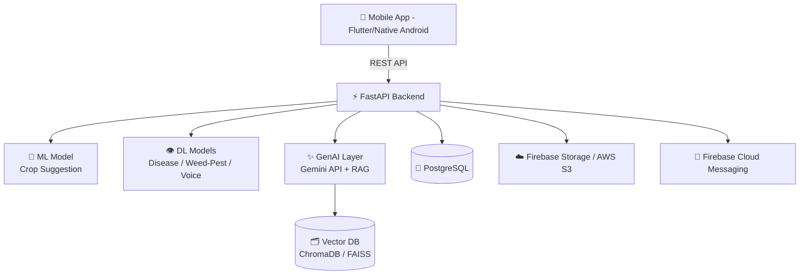

<div align="center">

# 🌾 Valam

### AI-Powered Farmer Assistant App

*Your complete digital companion for smarter farming*

[](#-project-status)
[](#-project-status)
[](#-project-status)
[](#-license)

[](#)
[](#)
[](#)
[](#)
[](#)
[](#)

**[🔗 Live Demo](#)** &nbsp;·&nbsp; **[📖 Documentation](#-table-of-contents)** &nbsp;·&nbsp; **[🐛 Report a Bug](#)** &nbsp;·&nbsp; **[✨ Request a Feature](#)**

> Live demo link coming soon — deployment in progress.

</div>

---

## 📋 Table of Contents

- [Overview](#-overview)
- [Problem Statement](#-problem-statement)
- [Project Status](#-project-status)
- [Core Features](#-core-features)
- [Technology Distribution](#-technology-distribution)
- [Architecture](#-architecture)
- [Machine Learning Component](#-machine-learning-component)
- [Deep Learning Components](#-deep-learning-components)
- [Generative AI Components](#-generative-ai-components)
- [Backend Stack](#-backend-stack)
- [Repository Structure](#-repository-structure)
- [Getting Started](#-getting-started)
- [API Reference](#-api-reference)
- [Roadmap](#-roadmap)
- [Contributing](#-contributing)
- [Author](#-author)
- [License](#-license)

---

## 🌱 Overview

**Valam** is an Android application designed to be a complete digital companion for farmers — helping them decide **what to grow, how to protect their crop, when to sell, and how to manage finances and government support**, all in their native language, with strong offline support for rural connectivity conditions.

The application is powered by a combination of **Machine Learning, Deep Learning, and Generative AI**, each applied where it genuinely fits the problem, backed by a **FastAPI** backend and a dedicated mobile frontend.

---

## 🎯 Problem Statement

Farmers across India face fragmented access to critical information — market prices, soil-specific crop guidance, pest and disease identification, government schemes, and financial record-keeping are scattered across multiple portals, apps, and informal sources. Most existing tools are either too generic, English-only, or require manual research that a farmer with limited digital literacy cannot easily perform.

**Valam consolidates these needs into one application**, using AI to translate raw data into direct, actionable guidance.

---

## 🚦 Project Status

| Layer | Status | Notes |
|:------|:------:|:------|
| 🧠 Machine Learning (Crop Suggestion) | ✅ **Done & Deployed** | Serving via FastAPI |
| 👁️ Deep Learning (Disease / Weed-Pest / Voice) | ✅ **Done & Deployed** | Serving via FastAPI |
| ✨ Generative AI (RAG + Gemini features) | 🚧 In Progress | 7 features planned |
| 📱 Mobile Frontend | 🚧 In Progress | Built independently |
| 🌐 Live Demo | ⏳ Not yet available | Link will be added here |

---

## ✨ Core Features

| # | Feature | Role in the App | Technology |
|:-:|---------|------------------|:----------:|
| 1 | **Land & Soil-Based Crop Suggestion** | Recommends the most suitable crop for a farmer's land based on soil nutrients, pH, and regional data | 🧠 ML |
| 2 | **Weed & Pest Detection** | Identifies weeds and pest infestation from a field photo | 👁️ DL |
| 3 | **Crop Disease Detection** | Identifies plant disease from a photo of the affected leaf/crop | 👁️ DL |
| 4 | **Native Language Voice Assistant** | Speak queries, get spoken responses — in the farmer's native language | 👁️ DL |
| 5 | **Market Price Advisor** | Converts raw mandi price data into plain-language sell/hold guidance | ✨ GenAI |
| 6 | **Pesticide & Treatment Advisor** | Pesticide type, dosage, and timing guidance based on identified disease | ✨ GenAI |
| 7 | **Expense Tracker** | Converts natural language/voice input ("spent 500 on urea") into structured records | ✨ GenAI |
| 8 | **Weather-Based Spray Advisory** | Interprets weather forecasts to advise spray or hold | ✨ GenAI |
| 9 | **Farmer Community Assistant** | Semantic search & auto-summarization of community discussions | ✨ GenAI |
| 10 | **Government Scheme Assistant** | Answers eligibility & application questions in plain language | ✨ GenAI |
| 11 | **Tutorial Library Assistant** | Summarizes & translates farming tutorials into native language | ✨ GenAI |

---

## 📊 Technology Distribution

<div align="center">

| Category | Count | Features |
|:--------:|:-----:|:---------|
| 🧠 **Machine Learning** | 1 | Crop Suggestion |
| 👁️ **Deep Learning** | 3 | Weed/Pest Detection · Disease Detection · Voice Assistant |
| ✨ **Generative AI** | 7 | Market Advisor · Pesticide Advisor · Expense Tracker · Weather Advisory · Community Assistant · Scheme Assistant · Tutorial Assistant |

</div>

```
ML  ██░░░░░░░░░░░░░░░░░░  1
DL  ██████░░░░░░░░░░░░░░  3
GEN ██████████████░░░░░░  7
```

---

## 🏗️ Architecture



---

## 🧠 Machine Learning Component

### Land & Soil-Based Crop Suggestion — ✅ Deployed

| Detail | Description |
|--------|--------------|
| **Objective** | Predict the most suitable crop for a given land based on soil and environmental parameters |
| **Model Type** | Classification — Random Forest / XGBoost |
| **Input Features** | Nitrogen (N), Phosphorus (P), Potassium (K), soil pH, temperature, humidity, rainfall |
| **Output** | Recommended crop label |
| **Dataset** | Crop Recommendation Dataset (Kaggle) + Soil Health Card (SHC) Dataset, Government of India |
| **Endpoint** | `POST /predict/crop` |

---

## 👁️ Deep Learning Components

### 1. Crop Disease Detection — ✅ Deployed

| Detail | Description |
|--------|--------------|
| **Objective** | Identify plant disease from an image of the crop leaf |
| **Model Type** | CNN using transfer learning |
| **Base Architecture** | MobileNetV2 / ResNet18 (pre-trained, fine-tuned) |
| **Dataset** | PlantVillage Dataset — 54,306 labeled images, 14 crop species, 26 diseases |
| **Deployment** | TensorFlow Lite (on-device) or `POST /predict/disease` |

### 2. Weed & Pest Detection — ✅ Deployed

| Detail | Description |
|--------|--------------|
| **Objective** | Detect weeds or pest damage in a field image |
| **Model Type** | CNN — image classification / object detection |
| **Dataset** | DeepWeeds Dataset + pest-damage image subsets |
| **Endpoint** | `POST /predict/weed-pest` |

### 3. Native Language Voice Assistant — ✅ Deployed

| Detail | Description |
|--------|--------------|
| **Objective** | Speech-to-text (query) and text-to-speech (response) in native language |
| **Models Used** | Whisper (STT) · Google Cloud TTS / equivalent neural TTS |
| **Dataset** | Pre-trained; optional fine-tuning with AI4Bharat regional speech corpora |
| **Integration** | Speech pipeline within the FastAPI backend |

---

## ✨ Generative AI Components

> Powered by the **Gemini API** — RAG where factual grounding is required, direct prompting for transformation tasks.

| Feature | GenAI Technique | Data Source |
|---------|------------------|-------------|
| Market Price Advisor | Prompt-based reasoning over live price data | AGMARKNET (data.gov.in) |
| Pesticide & Treatment Advisor | RAG over curated crop-disease-treatment data | ICAR advisories |
| Expense Tracker | Structured extraction from NL/voice input | User-generated |
| Weather-Based Spray Advisory | Prompt-based reasoning over forecast data | OpenWeatherMap / IMD |
| Farmer Community Assistant | RAG — semantic search & summarization | Community posts (embedded & indexed) |
| Government Scheme Assistant | RAG over scheme documentation | Kisan Suvidha, PM-AASHA, Govt. portals |
| Tutorial Library Assistant | Summarization & translation | Curated tutorials + user uploads |

---

## ⚙️ Backend Stack

| Layer | Technology |
|-------|-----------|
| API Framework | **FastAPI** (Python) |
| Database | **PostgreSQL** |
| ML/DL Serving | FastAPI endpoints + optional TensorFlow Lite |
| GenAI Integration | **Gemini API** — RAG pipeline (LangChain / LlamaIndex) |
| Vector Database | ChromaDB / FAISS |
| Authentication | JWT-based / Firebase Authentication |
| File & Image Storage | Firebase Storage / AWS S3 |
| Push Notifications | Firebase Cloud Messaging |
| Deployment | Render / Railway / Google Cloud Run |
| Frontend | Flutter / Native Android (independent team) |

---

## 📁 Repository Structure

```
valam/
├── backend/
│   ├── main.py                 # FastAPI app entrypoint
│   ├── models/
│   │   ├── crop_model.py       # ML: crop suggestion
│   │   ├── disease_model.py    # DL: disease detection
│   │   ├── weed_pest_model.py  # DL: weed & pest detection
│   │   └── voice_pipeline.py   # DL: STT/TTS pipeline
│   ├── genai/
│   │   ├── market_advisor.py
│   │   ├── pesticide_advisor.py
│   │   ├── expense_tracker.py
│   │   ├── weather_advisory.py
│   │   ├── community_assistant.py
│   │   ├── scheme_assistant.py
│   │   └── tutorial_assistant.py
│   ├── routers/
│   ├── database/
│   └── requirements.txt
├── frontend/                   # Flutter / Native Android (separate repo/team)
├── docs/
└── README.md
```

---

## 🚀 Getting Started

### Prerequisites

- Python 3.10+
- PostgreSQL
- Gemini API key
- (Optional) Firebase project for storage/auth/notifications

### Installation

```bash
# Clone the repository
git clone https://github.com/<your-org>/valam.git
cd valam/backend

# Create a virtual environment
python -m venv venv
source venv/bin/activate   # Windows: venv\Scripts\activate

# Install dependencies
pip install -r requirements.txt

# Configure environment variables
cp .env.example .env
# fill in DATABASE_URL, GEMINI_API_KEY, FIREBASE_CREDENTIALS, etc.

# Run the server
uvicorn main:app --reload
```

The API will be available at `http://localhost:8000`.

---

## 📡 API Reference

| Endpoint | Method | Status | Description |
|----------|:------:|:------:|-------------|
| `/predict/crop` | `POST` | ✅ Live | Soil/climate input → recommended crop |
| `/predict/disease` | `POST` | ✅ Live | Leaf image → disease diagnosis |
| `/predict/weed-pest` | `POST` | ✅ Live | Field image → weed/pest detection |
| `/voice/query` | `POST` | ✅ Live | Speech query → spoken response |
| `/genai/market-advisor` | `POST` | 🚧 Planned | Mandi prices → sell/hold advice |
| `/genai/pesticide-advisor` | `POST` | 🚧 Planned | Disease context → treatment guidance |
| `/genai/expense-tracker` | `POST` | 🚧 Planned | NL/voice input → structured expense |
| `/genai/weather-advisory` | `POST` | 🚧 Planned | Forecast → spray/hold advice |
| `/genai/community` | `GET/POST` | 🚧 Planned | Community search & summarization |
| `/genai/schemes` | `POST` | 🚧 Planned | Scheme eligibility Q&A |
| `/genai/tutorials` | `GET` | 🚧 Planned | Translated tutorial summaries |

---

## 🗺️ Roadmap

- [x] Crop suggestion model — trained & deployed
- [x] Disease detection model — trained & deployed
- [x] Weed & pest detection model — trained & deployed
- [x] Voice assistant pipeline — deployed
- [ ] RAG pipeline setup (ChromaDB/FAISS + LangChain)
- [ ] Market Price Advisor
- [ ] Pesticide & Treatment Advisor
- [ ] Expense Tracker
- [ ] Weather-Based Spray Advisory
- [ ] Farmer Community Assistant
- [ ] Government Scheme Assistant
- [ ] Tutorial Library Assistant
- [ ] Mobile frontend integration
- [ ] Public live demo

---

## 🤝 Contributing

Contributions, issues, and feature requests are welcome.

1. Fork the repository
2. Create your feature branch (`git checkout -b feature/amazing-feature`)
3. Commit your changes (`git commit -m 'Add some amazing feature'`)
4. Push to the branch (`git push origin feature/amazing-feature`)
5. Open a Pull Request

---

## 👤 Author

**Nithish Kumar S**

[](https://github.com/nithishkumar-dev-10)

---

## 📄 License

This project is licensed under the **MIT License** — see the [LICENSE](LICENSE) file for details.

<div align="center">

---

Made with 🌾 for farmers, by **Team Valam**

</div>
